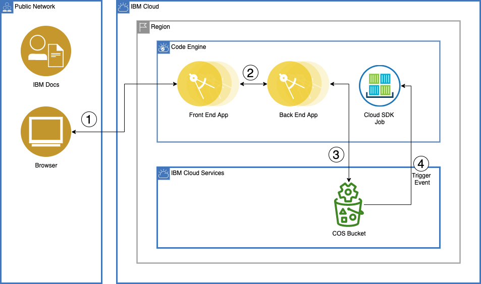
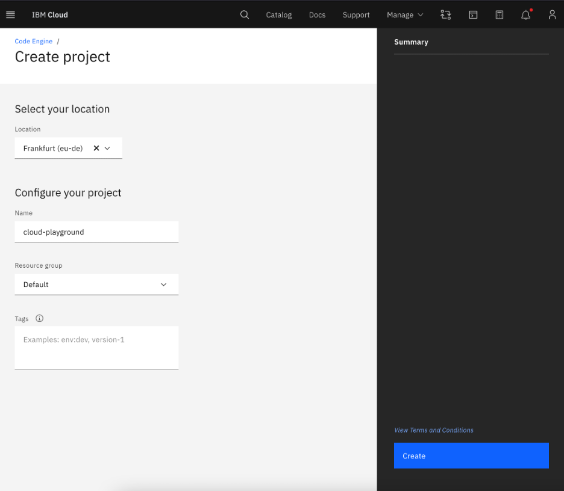
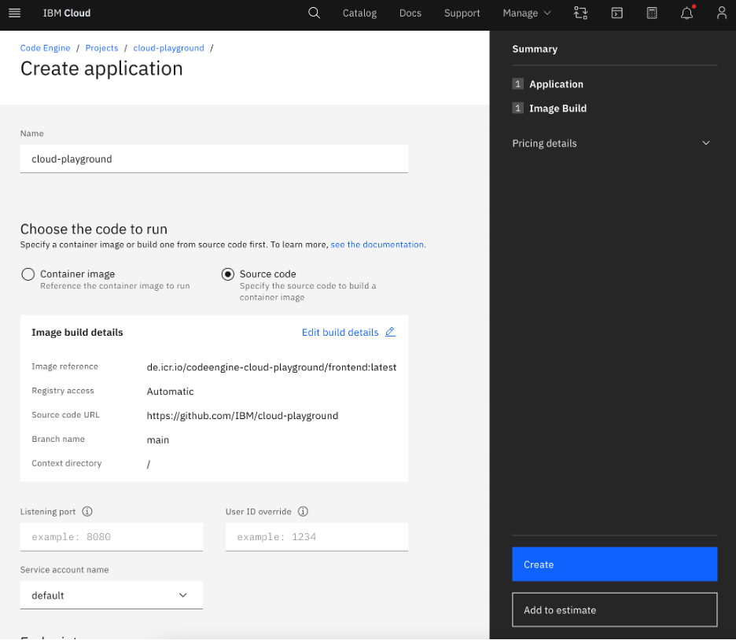
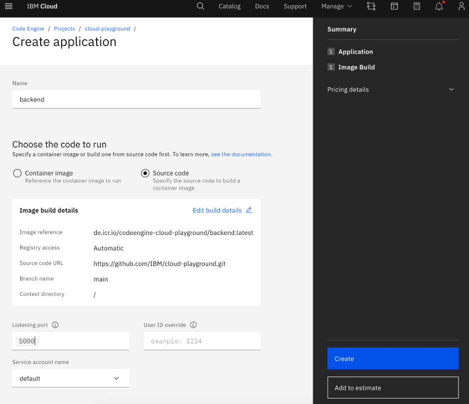
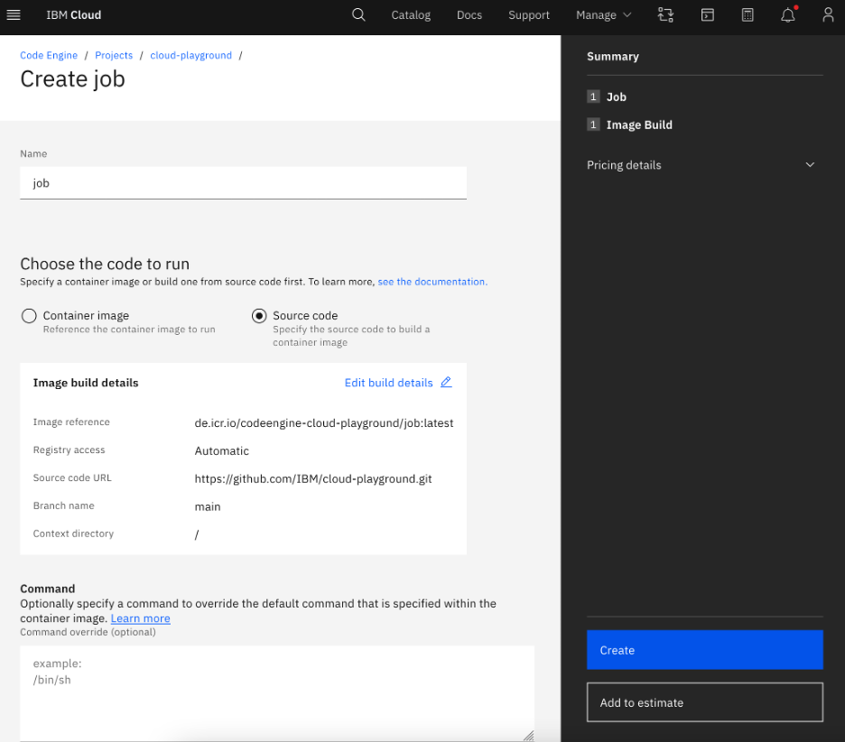
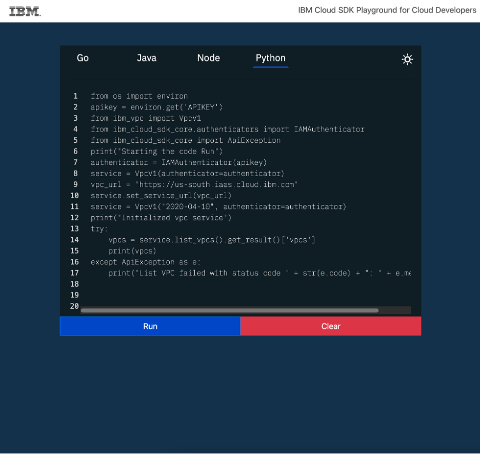

# IBM Cloud Playground using Code Engine

This tutorial may incur costs. Use the [Cost Estimator](https://cloud.ibm.com/estimator/review) to generate a cost estimate based on your projected usage.

In this cloud agnostic world, every day a new service is being introduced in order to meet the demands of the end users. These services provide certain APIs which the user can take advantage of by implementing their own solution. Most of the times, user might be using multiple cloud services in designing their solution which leads to the usage of several API SDKs, and they must maintain all those dependencies by themselves. To overcome this, IBM Cloud Playground provides a platform where all the IBM Cloud SDKs are pre-loaded in the backend services and the responsibility of the user is to implement their solution in any language and try out as quickly as possible.

This tutorial also covers one of the use-cases of IBM Cloud® Code Engine, since the playground is designed to run on the serverless architecture to utilize the resources only when its needed.


## Objectives
* Understand IBM Cloud® Code Engine to deploy the Playground
* Create frontend & backend applications
* Create job & subscribe to COS Events
* Create Object storage & other required configurations
* Write a code sample & run it on the playground



1. User writes the code in the Web browser.
2. The code file is transferred to the Backend application which then uploads to the COS Bucket.
3. Upon receiving the new file in COS, an write event is generated.
4. Code Engine Job is auto triggered from the event which executes the user code.
5. After execution, the output file is uploaded to the same COS Bucket.
6. Backend application fetches the output file & send it to the respective user.


## Before you begin
This tutorial requires:
* **IBM Cloud CLI** – This CLI tool will enable you to interact with IBM Cloud. 
    * code-engine/ce plugin (code-engine/ce) - Plugins extend the capabilities of the IBM Cloud CLI with commands specific to a service. The Code Engine plugin will give you access to Code Engine commands on IBM Cloud.
* **Git** – To clone the IBM Cloud playground project
    * [cloud-playground](https://github.com/IBM/cloud-playground)

You can run the sections requiring a shell in the [cloud-shell](https://cloud.ibm.com/docs/cloud-shell?topic=cloud-shell-getting-started).

You will find instructions to download and install these tools for your operating environment in the [Getting started with tutorials](https://cloud.ibm.com/docs/solution-tutorials?topic=solution-tutorials-tutorials) guide.

## STEP 1: CREATE AN IBM CLOUD CODE ENGINE PROJECT
1. Navigate to [IBM Cloud Code Engine Overview](https://cloud.ibm.com/codeengine/overview) page.
2. On the left pane, click on **Projects** and then click **Create project**,
    * Select a location.
    * Provide a project name and select a resource group where you will create your project and also the cloud services required in the later steps. Resource groups are a way for you to organize your account resources into customizable groupings.
    * Click on **Create**.
    * Wait until the project status changes to **Active**.



3. Open a terminal from your local machine and login to the ibmcloud CLI
   ```sh
   ibmcloud login --apikey <YOUR_API_KEY> -g Default -a https://cloud.ibm.com
   ```
4. Select the Code Engine project which was created in the previous step
   ```sh
   ibmcloud code-engine project select --name <PROJECT_NAME>
   ```

## STEP 2: CREATE FRONTEND & BACKEND APPLICATIONS
1. Select the created project in the UI & from the left pane, click on **Applications** and then click **Create**
2. Enter the frontend application name as **cloud-playground**
3. Select the Source Code radio button and enter the following URL
   [](https://github.com/IBM/cloud-playground)
4. Now Click **Specify build details**, which opens a new pane on the right
    * Enter the **Branch name** as **main** & click **Next**
    * Enter the **Dockerfile** as **frontend/Dockerfile** & click **Next**
    * In **Namespace** text box, type **codeengine-cloud-playground** as registry namespace
    * For **Repository (image name)**, type **frontend**
    * For **Tag**, type **latest** (any tag you can specify here) & click **Done**
5.	All the details you’ve entered should look similar to this image & click **Create**



6. Follow the same procedure for creating a backend application with the specified details
    * Name as **backend**
    * On the **Specify build section**, provide **Dockerfile** as **backend/Dockerfile**
    * For **Repository (image name)**, type **backend**
    * For **Listening port**, type **5000**
7. All the details you’ve entered should look similar to this image & click **Create**



After creating applications, Code Engine will automatically submit 2 new build jobs to build the required container images for deploying the application. You can view those build jobs by clicking the Image builds from the left pane.

## STEP 3: CREATE CODE ENGINE JOB
1. Select the created project in the UI & from the left pane, click on **Jobs** and then click **Create**
2. Follow the same procedure for creating a job with the specified details
    * Name as **job**
    * On the **Specify build section**, provide **Dockerfile** as **job/Dockerfile**
    * For **Repository (image name)**, type **job**
3. All the details you’ve entered should look similar to this image & click **Create**



After creating job, Code Engine will automatically submit a new build jobs to build the required container images for deploying the job. You can view those build jobs by clicking the Image builds from the left pane.

## STEP 4: CREATE OTHER REQUIRED CONFIGURATIONS
In order to stitch the whole pieces, following configurations are required and we’ve a script in place which configures everything for us
1. Create or Use existing **Cloud Object Storage**
2. Create a **Bucket** in the COS
3. Create a **IAM authorization policy** to receive notifications from COS
4. Create a **Service ID** for COS which the Code Engine uses to access the COS buckets
5. Create a **Service Policy** to provide necessary Write permission
6. Create a **Service API Key** for the service id to securely access the COS buckets
7. Create a **IAM API key** for the job to execute the user code
8. Create a **Code Engine Subscription to COS** to handle the Write events.
9. Create a **ConfigMap** of BackendURL to the frontend application
10. Create a **ConfigMap** of COS Config to the backend application & job
11. Create a COS API Key **Secret** to the backend application
12.	Create a IAM API Key **Secret** to the job

Before running the config script, following variables needs to be exported
* This variable is optional and if the user doesn’t provide any value, the script creates a new COS instance to use.
```sh
export COS=<Your_COS_Instance_Name>
```
* If you’ve created frontend application with different name, you can specify it here
```sh
export FRONTEND_NAME=”cloud-playground”
```
* If you’ve created backend application with different name, you can specify it here
```sh
export BACKEND_NAME=”backend”
```
* If you’ve created job with different name, you can specify it here
```sh
export JOB_NAME=”job”
```
* Select the Code Engine project
```sh
ibmcloud code-engine project select --name <PROJECT_NAME>
```
* Clone the cloud playground project, if it isn’t done before and run the following script
```sh
cd cloud-playground
./scripts/config.sh
```

## STEP 5: PLAY WITH CLOUD PLAYGROUND
After the successful completion of the config script, the Cloud Playground platform is ready to run the user code. 
* To access the frontend URL, select the created project in the UI & from the left pane, click on **Applications**
* On the right pane, click **Open URL** of the frontend application which opens the following UI in the new tab of the browser.



* It might take a while to load the UI Initially, since the Code Engine has to spin up the frontend containers to use.
* Remember to include these 2 lines on the top, if the user code requires IAM API Key
```py
from os import environ
apikey = environ.get('APIKEY')
```
* Currently **the backend supports VPC & COS Python SDKs only**. If user wants to use the Python SDKs of another IBM Cloud service, the same can be updated in the job/Dockerfile and Build & Redeploy the Job.

## STEP 6: DELETE RESOURCES
1. With the command below, delete the project to delete all its components (applications, jobs etc.)
```sh
ibmcloud code-engine project delete --name <PROJECT_NAME>
```
2. Navigate to [Resource List](https://cloud.ibm.com/resources/) and delete the IBM Cloud Object Storage instance created by config script
3. Navigate to [Service IDs](https://cloud.ibm.com/iam/serviceids) section of IAM and delete the created cloud-playground-service-id
4. Navigate to [API keys](https://cloud.ibm.com/iam/apikeys) section of IAM and delete the created cloud-playground-iam-key
5. Navigate to [Authorizations](https://cloud.ibm.com/iam/authorizations) section of IAM and delete the created Notification Manager Role for Code Engine & COS.

## FINALE:
If you’re here, then you have got excellent hands on IBM Cloud’s Code Engine as well as deployed the cloud playground platform successfully to quickly test your code. If you would like to provide new features & polish the application a bit more, You all are most welcome to contribute

## RELATED LINKS:
* [IBM Cloud Code Engine](https://cloud.ibm.com/docs/codeengine)
* [cloud-playground](https://github.com/IBM/cloud-playground)
